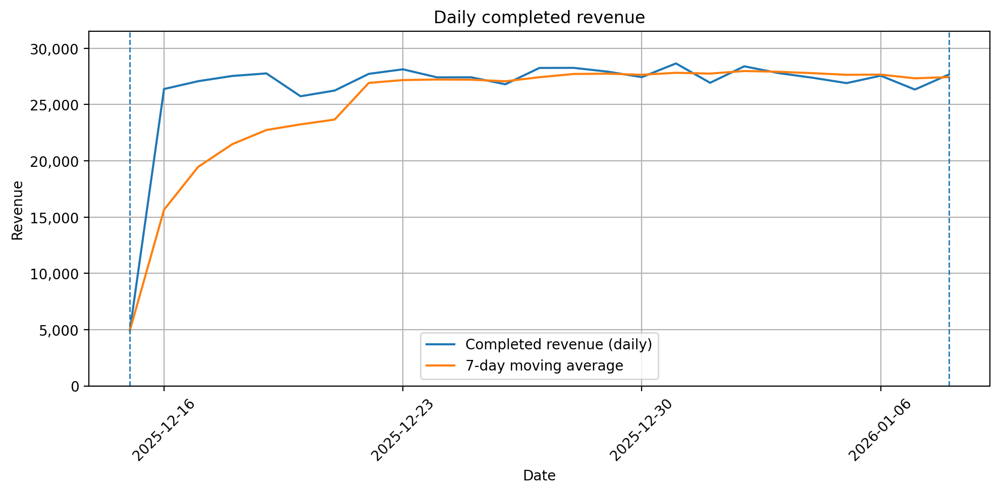
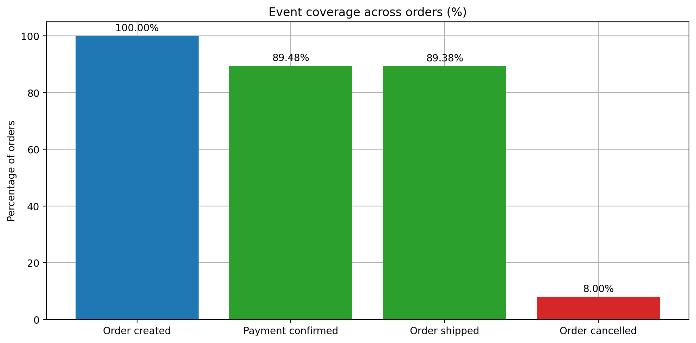
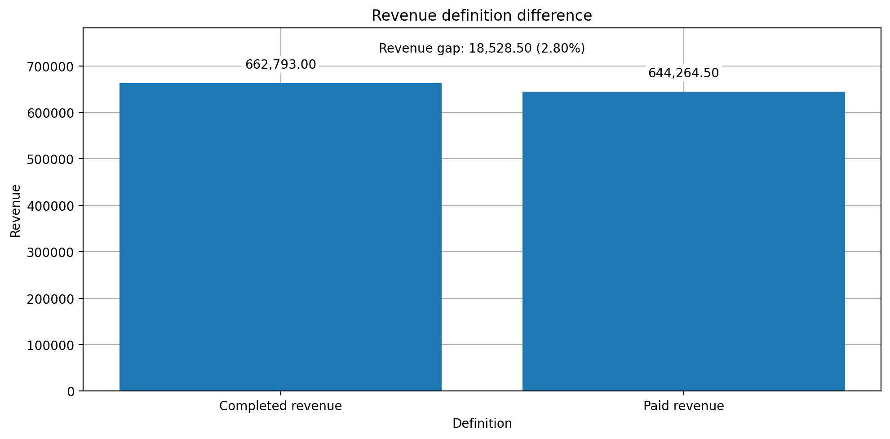

# Order-to-Insight  
End-to-end data pipeline from raw events to business insight  

🇫🇮 Finnish summary: [README.fi.md](README.fi.md)

## TL;DR

This project builds a SQL-first analytical pipeline that transforms raw
order and event data into reliable fact tables for business reporting.

Raw data is validated, modeled, and tested for consistency.
Revenue is intentionally calculated in multiple ways to demonstrate
how data completeness and metric definitions affect reported results.

The focus is on:

- SQL-based modeling  
- Explicit data quality validation  
- Clear metric definitions  
- Understanding how modeling decisions influence business metrics  

This project is most relevant for analytics engineering and data engineering roles.

---

## 1. Problem

In many systems, business metrics depend on multiple data sources:

- Transactional data (orders, amounts, statuses)
- Event data (creation, payment, shipment, cancellation timestamps)

These sources are often:

- Incomplete  
- Inconsistent  
- Missing timestamps  
- Misaligned in logic  

If modeling decisions are unclear, business metrics such as revenue can change depending on how they are defined.

The core question of this project:

> How can raw transactional and event data be modeled into reliable analytical tables, and how do modeling choices affect business metrics?

---

## 2. What was built

The project implements a structured data pipeline with five stages:

1. **Data ingestion**  
   Synthetic but realistic order and event data is generated.

2. **Data quality validation**  
   Missing and inconsistent records are identified and logged.

3. **SQL-based modeling**  
   Events and transactions are joined into structured fact tables.

4. **Analysis layer**  
   Reproducible SQL queries generate business metrics.

5. **Visual validation**  
   A Jupyter notebook verifies aggregation logic and metric definitions.

All processing runs locally using DuckDB.

---

## 3. Data model

The analytical layer contains structured fact tables such as:

- `fct_orders`
- `fct_daily_revenue`

The model explicitly surfaces data quality issues, including:

- Completed orders without payment events  
- Cancelled orders with shipment events  
- Missing lifecycle timestamps  

These issues are not hidden. They are measured.

---

## 4. Key analytical findings

### 4.1 Event completeness

Not all completed orders have corresponding payment or shipment events.

This creates a gap between:

- Order status  
- Recorded lifecycle events  

Event data alone is not sufficient for reliable revenue reporting.

---

### 4.2 Revenue definition difference

Revenue can be calculated in two ways:

1. **Status-based revenue**  
   All orders marked as completed.

2. **Event-based revenue**  
   Only completed orders that also have a recorded payment event.

Because some completed orders are missing payment events,  
these two revenue numbers are not equal.

This means revenue depends on how it is defined.

The business impact is not the size of the difference itself.  
The business impact is that metric definitions directly affect reported results.

---

### 4.3 Data quality → Metric definition → Business decision

The project demonstrates a chain:

Data quality  
→ Influences metric construction  
→ Influences reported numbers  
→ Influences decisions  

Without explicit modeling and validation, metrics may look correct but still be wrong.

---

## 5. Visual validation

The following figures validate the modeled data and demonstrate how
data quality affects business metrics.

### Daily completed revenue



This chart validates daily aggregation and temporal continuity.
No unexpected spikes or gaps are present.
Boundary effects at the beginning and end of the dataset are visible.

### Event coverage across orders



Not all completed orders have corresponding payment or shipment events.
Event data alone is therefore not sufficient for reliable revenue reporting.

### Revenue definition difference



Revenue can be calculated in two ways:
- Based on order status
- Based on confirmed payment events

Because some completed orders are missing payment events,
the reported revenue depends on how it is defined.

This demonstrates how data completeness directly affects business reporting.

---

## 6. What this project demonstrates

This project demonstrates:

- Ability to design a layered data pipeline  
- SQL-first analytical modeling  
- Structured handling of data quality issues  
- Clear communication of metric assumptions  
- Understanding that business metrics depend on modeling logic  

It shows practical analytics engineering thinking.

---

## 7. Repository structure

```
ingestion/        Data generation and validation scripts  
transformations/  SQL models  
analysis/         Analytical queries and visual validation  
data/             Raw and processed outputs  
scripts/          Pipeline execution scripts  
```

---

## 8. How to run

1. Generate data
```
python ingestion/ingest.py
```

2. Build models
```
python scripts/run_transformations.py
```

3. Run analysis
```
python scripts/run_insights.py
```

4. Optional: open the notebook
```
analysis/order_to_insight_visuals.ipynb
```

---

## 9. Production considerations

In a production setting, this pipeline would include:

- Automated data quality monitoring  
- Scheduled orchestration  
- Versioned models  
- Alerting for event coverage drops  

The modeling logic itself would remain similar.

---

## Conclusion

Revenue is not a fixed number.  
It depends on how it is defined and which data fields are used.

This project shows that:

- Data completeness must be measured  
- Metric definitions must be explicit  
- Analytical trust depends on modeling clarity  

Without this foundation, business reporting can be inconsistent even when the data appears complete.
