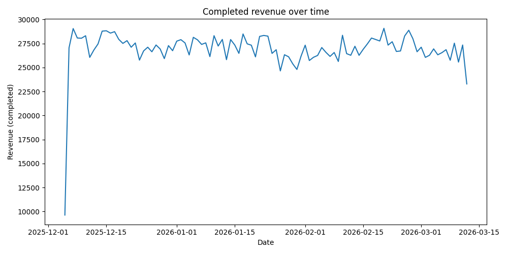
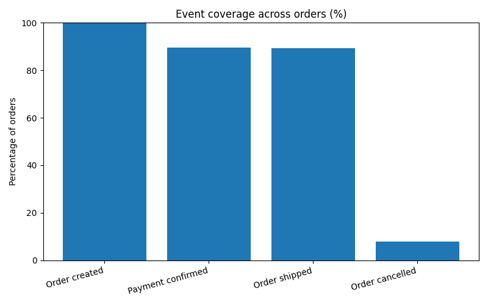

# Order-to-Insight
End-to-end data pipeline from raw events to business insights

🇫🇮 **Suomenkielinen tiivistelmä:** [README.fi.md](README.fi.md)

## TL;DR

This project demonstrates an end-to-end analytical workflow that transforms raw, imperfect
event-level and transactional data into business-relevant insights.

The emphasis is on SQL-centric modeling, data correctness, and analytical trust rather than
advanced modeling or dashboards. Particular attention is paid to data quality issues,
event incompleteness, and the impact of modeling choices on business conclusions.

Technologies used include SQL, Python, and DuckDB, forming a lightweight and fully local
analytical stack.

---

## Project context and problem definition

In many organizations, business-critical metrics rely on data originating from multiple
systems. Orders, payments, and operational events are often captured independently, with
inconsistent schemas, missing records, and unreliable timestamps.

This project simulates the work of an internal analytics or data engineering team tasked
with turning such raw order and event data into a trustworthy analytical foundation.

The core question addressed is:

**How can raw event-based and transactional data be modeled into reliable analytical
datasets, and how do modeling decisions directly influence the validity of business insights?**

---

## Project goals

The main goals of this project are to:

1. Demonstrate understanding of the full analytical data lifecycle, from ingestion to interpretation.
2. Apply practical data engineering techniques such as validation, transformation, and modeling.
3. Use SQL as the primary tool for analytical logic and business rules.
4. Surface common data quality issues and analytical failure modes explicitly.
5. Communicate results with clear assumptions, limitations, and risks.

This is intentionally not a machine learning project.  
The focus is on analytical foundations, correctness, and interpretability.

The project is designed as a learning and portfolio project for data analytics and analytics
engineering roles.

---

## Data overview

The project combines two complementary data sources:

- **Event data**, representing system-level lifecycle events such as order creation,
  payment confirmation, shipment, and cancellation.
- **Transactional data**, representing business-level facts such as orders, monetary values,
  order status, and customer identifiers.

The data is synthetically generated but intentionally designed to be structurally realistic.
It includes common real-world issues such as missing events, inconsistent timestamps,
duplicate identifiers, and incomplete records.

---

## End-to-end data pipeline

The pipeline follows a clear, layered analytical structure:

1. **Data ingestion**  
   Raw data is generated or loaded using Python and written to disk in its original form,
   without modification.

2. **Data validation and enrichment**  
   Basic data quality checks identify missing, inconsistent, or suspicious records.
   Selected issues are propagated into the modeled layer as explicit quality flags.

3. **Data transformation and modeling**  
   SQL-based transformations join events and transactions, normalize timestamps,
   and construct fact-style tables suitable for analytical use.

4. **Analysis and insights**  
   Reproducible SQL queries answer business questions related to revenue,
   order outcomes, event coverage, and operational timing.

5. **Interpretation and documentation**  
   Results are interpreted with explicit attention to assumptions,
   limitations, and potential sources of misinterpretation.

DuckDB is used as the analytical database to keep the project fully local,
reproducible, and strongly SQL-oriented while still supporting realistic workloads.

---

## Repository structure

The repository mirrors the logical stages of the pipeline:

- `ingestion` contains Python scripts for raw data generation and validation.
- `data` separates raw inputs from processed and analytical outputs.
- `transformations` contains SQL models defining the analytical data layer.
- `analysis` contains SQL queries used to derive business insights.
- `ai` documents the limited and transparent use of AI tools during the project.
- This README provides overall context, rationale, and conclusions.

---

## Use of AI tools

AI tools were used in a limited and transparent role.

They served primarily as a secondary reviewer to challenge assumptions,
suggest validation checks, and sanity-check interpretations.

AI was not used to automatically generate analytical results or replace
human judgment. All modeling and analytical decisions were made explicitly
and documented.

---

## Analysis results and key findings

This section summarizes the analytical results produced from the modeled data layer.
All results are generated by running the SQL queries in `analysis/insights.sql`
against the DuckDB warehouse and written to `data/processed/analysis_results.txt`.

**Note:** The values below correspond to a concrete example run with `n = 20,000` orders.
The pipeline is parameterized and scales consistently with different dataset sizes.

### Business-level snapshot

- Total orders: **20,000**
- Completed orders: **17,848**
- Cancelled orders: **1,600**
- Refunded orders: **552**

- Total completed revenue: **2,638,001.00**
- Average order value (completed): **147.80**

**Interpretation:**  
The majority of orders reach completion (~89%), with cancellation and refund rates
within a realistic operational range. These figures provide a stable baseline
for downstream trend and consistency analysis.

---

### Daily revenue and order volume

Daily order volume remains stable at approximately **205–206 orders per day**,
with completed orders typically ranging between **175 and 195**.

Daily completed revenue fluctuates within a narrow band, mostly between
**25,000 and 29,000**, with the final day showing a partial count due to an
incomplete ingestion window.

**Interpretation:**  
The absence of unexpected spikes or gaps suggests that temporal aggregation
and order-to-event alignment are functioning as intended.
The partial final day illustrates a typical boundary effect that must be
considered in time-series analysis.

---

### Data quality signals in the modeled layer

The fact table includes explicit quality indicators derived during modeling.

- Completed orders missing a payment confirmation event: **477**
- Cancelled orders that still have a shipment event: **31**

**Interpretation:**  
These inconsistencies demonstrate why neither event data nor transactional
status can be treated as unquestioned ground truth.
By surfacing such issues explicitly, the model enables informed analytical
trade-offs instead of silently masking data quality risks.

---

### Event coverage across orders

- Orders with `order_created` event: **100.00%**
- Orders with `payment_confirmed` event: **89.55%**
- Orders with `order_shipped` event: **89.40%**
- Orders with `order_cancelled` event: **8.00%**

**Interpretation:**  
A non-trivial share of completed orders lacks corresponding payment or shipment
events. Analyses relying solely on event data would therefore undercount both
orders and revenue. The project makes these coverage gaps explicit rather than
allowing them to distort aggregate metrics.

---

### Operational timing example

- Average time from payment confirmation to shipment: **237 minutes**
- Minimum: **237 minutes**
- Maximum: **237 minutes**

**Interpretation:**  
The constant lead time reflects the fixed offsets used in the synthetic data
generator. In real production data this metric typically varies and becomes
an operational KPI, but it is also highly sensitive to missing or misordered events.

---

### Notable edge case: missing customer identifiers

Top customers by completed revenue include records with missing `customer_id`.

**Interpretation:**  
Missing customer identifiers are common in transactional systems and can distort
customer ranking, segmentation, and lifetime value analysis.
By exposing this issue directly, the project highlights the need for either
upstream remediation or explicit downstream handling.

---

## Visual validation

In addition to SQL-based analysis, the project includes a small set of visual
checks implemented in a Jupyter notebook.

The purpose of these visuals is validation and interpretability, not dashboarding.
All figures are derived from modeled tables (not raw data).

### Completed revenue over time



This daily time-series validates the revenue aggregation logic based on completed
orders. The stable trend confirms temporal continuity, while the lower values at
the dataset boundaries illustrate typical partial-day effects caused by incomplete
ingestion windows.

---

### Event coverage across orders



The chart shows the percentage of orders with recorded lifecycle events.
Not all completed orders have corresponding payment or shipment events, highlighting
the analytical risk of relying exclusively on event-level data for business metrics.

---

### Missing lifecycle events among completed orders (advanced)

A deeper analysis focusing exclusively on completed orders is included in the
accompanying notebook. It quantifies how often key lifecycle events are missing
even in the highest-value segment and further reinforces the need to reconcile
transactional status with event data before drawing business conclusions.

---

## What was learned

- Analytical reliability depends more on data quality and modeling decisions
  than on complex algorithms.
- Event timing and completeness can materially distort otherwise simple aggregations.
- Clear separation between raw data, modeled data, and analysis improves both
  correctness and maintainability.
- Explicitly documenting assumptions and limitations is essential for responsible analytics.

---

## What would be done differently in production

In a production setting, this pipeline would be extended with automated data
quality monitoring, orchestration, and alerting.

Transformations would be scheduled and tested more rigorously, and access controls
would be applied. The core analytical logic and modeling approach, however, would
remain largely unchanged.

---

## Risks and potential misinterpretations

- Incomplete event data may bias funnel and lead-time analyses.
- Timestamp inconsistencies can distort time-based metrics if not normalized.
- Aggregations may hide edge cases or operational anomalies.

All results should be interpreted with these limitations in mind.

---

## How to run the project

All steps can be executed locally using Python and DuckDB.

1. Generate raw data and data quality reports  
   ```text
   python ingestion/ingest.py
   ```

2. Build the analytical models  
   ```text
   python run_models.py
   ```

3. Run analytical queries and generate results
   ```text
   python run_analysis.py
   ```

## Project outputs

After running the full pipeline, the following artifacts are produced.

Raw data:
- data/raw/orders.csv
- data/raw/order_events.csv

Processed and analytical outputs:
- data/processed/data_quality_report.csv
- data/processed/failed_samples.csv
- data/processed/warehouse.duckdb
- data/processed/analysis_results.txt
